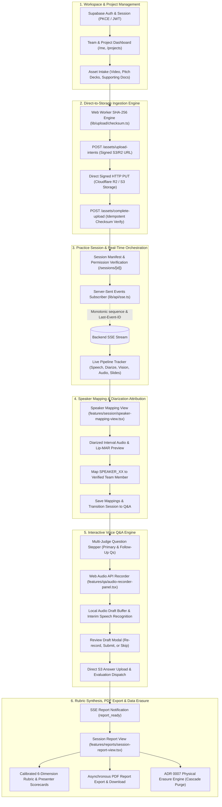

# VirtuJudge Frontend Client

[](https://github.com/VirtuJudge/Frontend)
[-black?style=flat&logo=next.js)](https://nextjs.org/)
[](https://react.dev/)
[](tests/)
[](tsconfig.json)
[](app/globals.css)
[](tests/accessibility.test.tsx)
[](features/reports/session-report-view.tsx)
[]()

Modern Next.js client for multimodal startup pitch recording, direct signed asset uploads, practice session orchestration, live diarized speaker mapping, interactive voice Q&A evaluations, rubric-grounded reports, and compliant data deletion.

---

## 🚀 Live Cloud Deployment & Environments

The VirtuJudge Frontend connects to the cloud backend control plane and object storage architecture:

- **Production Control Plane**: [https://virtujudge-backend.onrender.com](https://virtujudge-backend.onrender.com) (FastAPI + PostgreSQL pgvector + Redis)
- **Object Storage Engine**: Cloudflare R2 / AWS S3 presigned PUT buckets for media and document versioning
- **Authentication Provider**: Supabase Auth integration (`@supabase/supabase-js`) with PKCE verification and secure cookie-based session management
- **Real-Time Event Stream**: Resilient Server-Sent Events (SSE) listener (`lib/api/sse.ts`) supporting monotonic sequence tracking and auto-reconnect via `Last-Event-ID`
- **Local API Proxy**: Development calls route through `/api/v1` and forward via `BACKEND_INTERNAL_LOCAL_URL` to prevent browser CORS constraints

---

## 🏗️ Architecture Overview

The frontend operates as a state-reconciling presentation layer. Heavy compute, AI evaluations, and persistent permissions reside on the server; the client handles media capture, optimistic uploads, real-time feedback, and accessible interaction:



---

## 📋 The 5 Critical Frontend Lifecycle Phases

The application lifecycle follows the contracts defined in `lib/api/types.ts` and the [Frontend Architecture specification](https://github.com/VirtuJudge/Docs/blob/main/Architecture/Frontend-Architecture.md):

### 1. Workspace, Teams & Asset Management
- **Multi-Tenant Workspaces**: Manage teams, invite members by email with role-based permissions (`owner` or `member`), and track Gmail delivery statuses (`queued`, `accepted_by_gmail`, `failed`).
- **Project Asset Hub**: Versioned asset storage for pitch presentation videos, slide decks (`.pdf`, `.pptx`), and supporting materials.
- **Document Versioning**: Track immutable asset versions (`AssetVersion`) with SHA-256 checksums, byte sizes, and duration metadata.

### 2. Direct Signed Uploads & Hashing Engine
- **Direct S3/R2 Ingestion**: Browser uploads stream directly to Cloudflare R2 / S3 via signed PUT URLs (`UploadIntent`), bypassing backend proxy bottlenecks for multi-gigabyte media.
- **Dedicated Web Worker Checksums**: Offloads SHA-256 calculation (`lib/upload/checksum.ts`) to a background browser Web Worker with crypto subtle digest fallback.
- **Idempotency & Replay Protection**: Requests enforce client-generated `Idempotency-Key` headers to guard against double starts, duplicates, and retry hazards.

### 3. Practice Session Orchestration & Speaker Mapping
- **Manifest Freezing**: Practice sessions lock selected video and slide deck versions into an immutable `SessionManifest`.
- **Live Multimodal Tracking**: SSE notifications stream live stage progress across Speech, Diarization, Vision, Acoustics, Documents, and Grounding.
- **Speaker Attribution**: The Speaker Mapping interface (`features/session/speaker-mapping-view.tsx`) visualizes detected voice clusters (`SPEAKER_00`, `SPEAKER_01`) and allows presenters to assign team members with duplicate-collision prevention.

### 4. Interactive Q&A Stage & Audio Recorder
- **Hardware Permission Safeguards**: Explicit user consent and microphone checks before activating audio recording.
- **Web Audio API Capture**: `useAudioRecorder` hook manages audio streaming, duration countdowns, live waveform activity, and time-limit warnings.
- **Real-Time Drafts & Transcription**: Interim speech recognition generates draft transcript previews locally without committing to storage until verified.
- **Review, Re-record & Skip**: Presenters can review audio drafts, re-record answers, skip questions cleanly with `0.0` penalization without breaking rubric integrity, or submit to trigger dynamic follow-ups.

### 5. Rubric Report Synthesis, PDF Export & Erasure
- **Calibrated Startup Rubric**: Renders overall scores and weighted dimension breakdowns across the 6 core rubric dimensions.
- **Individual Presenter Scorecards**: Displays member-specific strengths, improvement areas, gaze alignment, posture openness, and speaking pace.
- **Asynchronous PDF Export**: Dispatches PDF render jobs, polls export status, and generates signed download intents.
- **Physical Erasure (ADR 0007)**: Dispatches scoped cascade erasure (`practice_session`, `project`, `team`, or `asset`), purging object storage, vector chunks, and database records while updating the UI state cleanly.

---

## ⚖️ State Ownership & Resilience Model

To ensure zero state drift and resilient offline/interruption recovery, state ownership is strictly segregated:

| State Domain | Owner | Client Resilience & Recovery Strategy |
| :--- | :--- | :--- |
| **Authentication & Session** | Supabase OIDC / Auth | Secure cookies + PKCE callback validation + auto-refresh |
| **Teams, Projects & Assets** | Backend REST API | TanStack Query cache; stale-while-revalidate invalidation |
| **Upload Task & Progress** | Browser Task State | Determinate XHR progress + Web Worker SHA-256 verification |
| **Recording Drafts** | Browser Feature State | Audio kept locally in memory; never committed until user confirmation |
| **Pipeline & Analysis Status** | Backend Engine | SSE stream; auto-reconnects with `Last-Event-ID` and refetches session |
| **State Mutation Safety** | Request Header | Deterministic `Idempotency-Key` headers on all POST/DELETE mutations |

---

## 📊 Calibrated Startup Rubric UI Mapping

The report dashboard (`features/reports/session-report-view.tsx`) visualizes pitch performance grounded in the calibrated startup pitch rubric (`STARTUP_PITCH_RUBRIC_V1`):

| Rubric Dimension | Weight | Visualization & Metric Mapping |
| :--- | :---: | :--- |
| **`pitch_content_and_evidence`** | **25%** | Problem clarity, market sizing (TAM/SAM), and evidence-backed claims. |
| **`business_and_problem_solution_reasoning`** | **20%** | Unit economics, monetization, and competitive differentiation. |
| **`technical_feasibility`** | **15%** | Architecture depth, proprietary tech, and technical defensibility. |
| **`delivery_and_body_language`** | **15%** | Gaze alignment, posture openness, and head pose stability scorecards. |
| **`timing_and_speech_mechanics`** | **5%** | Speaking pace (130–160 WPM ideal), pause discipline, and verbal fillers. |
| **`qa_quality`** | **20%** | Responsiveness, depth, evidence citation, and follow-up performance. |

- **Score Range**: Dimension scores in `[0.0, 1.0]` scale to display scores in `[0, 100]`.
- **Qualitative Rating Bands**: `0–39` Needs Work · `40–59` Developing · `60–79` Good · `80–100` Strong.
- **Dynamic Rebalancing**: Automatically renormalizes weights when optional media inputs (e.g. video camera streams) are omitted.

---

## ♿ Accessibility & Quality Standards

- **WCAG Compliance**: Tested with `axe-core` in CI (`tests/accessibility.test.tsx`) with zero critical or serious accessibility violations.
- **Keyboard Operability**: Full keyboard navigation across modals, stepper flows, dropdowns, and recording controls with visible focus rings.
- **Non-Color Indicators**: Recording states, timer warnings, and error banners incorporate explicit icon and textual indicators for color-blind accessibility.
- **Reduced Motion**: Respects `prefers-reduced-motion` across animated UI components and transitions.

---

## 📂 Repository Structure

```text
Frontend/
├── app/                              # Next.js 16 App Router routes and layouts
│   ├── (auth)/                       # Authenticated workspace routes
│   │   ├── me/                       # User profile, default workspace & session history
│   │   ├── projects/[projectId]/     # Project asset registry & session launcher
│   │   ├── sessions/[sessionId]/     # Practice session lifecycle (Upload, Diarize, Q&A, Report)
│   │   └── teams/[teamId]/           # Team member management & invitations
│   ├── (public)/                     # Public & marketing routes
│   │   ├── auth/                     # Login, register, password recovery, verification
│   │   ├── company/                  # Terms, privacy policy, contact us
│   │   ├── home/                     # Landing page and hero showcases
│   │   ├── invitations/[token]/      # Team invite acceptance & preview
│   │   └── pricing/                  # Plan tiers and feature matrices
│   ├── globals.css                   # Tailwind CSS v4 styling & glassmorphism theme
│   └── layout.tsx                    # Root layout & TanStack Query provider
├── components/                       # Shared design system primitives
│   ├── Nav-Bar/                      # Responsive navigation bars & workspace pickers
│   ├── button.tsx                    # Accessible button with glass & primary variants
│   ├── modal.tsx                     # Dialog modal with keyboard trap & backdrop blur
│   ├── file-dropzone.tsx             # Drag-and-drop file upload container
│   └── wrapper.tsx                   # Glassmorphic card and section containers
├── features/                         # Modular domain feature slices
│   ├── auth/                         # Supabase authentication context & guards
│   ├── projects/                     # Project creation, asset cards, and delete modals
│   ├── qa/                           # Audio recorder panel, question stepper & draft review
│   ├── reports/                      # Calibrated report view, scorecards & PDF exporter
│   ├── session/                      # Speaker mapping, progress tracker & stage controller
│   ├── teams/                        # Team selector, member roster & invitation modals
│   └── upload/                       # Direct S3 upload progress, dropzones & version picker
├── hooks/                            # Reusable React hooks
│   ├── use-audio-recorder.ts         # Web Audio API recording state machine
│   ├── use-direct-upload.ts          # S3 direct PUT uploader with progress tracking
│   ├── use-qa-session.ts             # Q&A round state & idempotent submission handler
│   └── use-session-timer.ts          # Practice session timer with persistence
├── lib/                              # Core clients, utilities & infrastructure
│   ├── api/                          # Strongly typed API client & SSE helper
│   │   ├── client.ts                 # Fetch wrapper with Problem Details error handling
│   │   ├── sse.ts                    # SSE connection manager with auto-reconnect
│   │   └── types.ts                  # Pydantic-synchronized TypeScript data contracts
│   ├── auth/                         # Supabase client, cookies & JWT decoding
│   └── upload/                       # Web Worker SHA-256 checksums & validation rules
├── scripts/                          # Repository governance & CI scripts
│   └── validate-repository.sh        # Required files & environment credential scanner
├── tests/                            # Comprehensive Vitest & Testing Library suite (271 tests)
│   ├── e2e/                          # Playwright browser end-to-end test scenarios
│   ├── accessibility.test.tsx        # axe-core automated accessibility suite
│   ├── qa-components-and-page.test.tsx # Voice recorder & Q&A stepper verification
│   ├── speaker-mapping-view.test.tsx # Diarization attribution & collision prevention
│   └── upload-infrastructure.test.ts # Web Worker hashing & direct upload resilience
├── package.json                      # Next.js 16, React 19, Tailwind v4 dependencies
└── tsconfig.json                     # Strict TypeScript configuration
```

---

## 🧪 Testing & Verification

The frontend enforces strict verification across unit tests, browser E2E workflows, strict types, and linting:

```bash
# Start local development server
npm run dev

# Run unit and component test suite (Vitest + Testing Library)
npm run test

# Run browser end-to-end tests (Playwright)
npm run test:e2e

# Run strict TypeScript type verification
npm run typecheck

# Run ESLint check
npm run lint

# Validate repository integrity & security policies
npm run check

# Create production build
npm run build
```

**Unit & Integration Test Status:** `36 test files passed (36), 271 tests passed (100% pass rate)`.
**Accessibility Status:** `0 critical / serious axe-core violations`.
