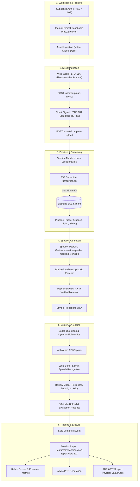

# VirtuJudge Frontend Client

[](https://github.com/VirtuJudge/Frontend)
[-black?style=flat&logo=next.js)](https://nextjs.org/)
[](https://react.dev/)
[](tests/)
[](tsconfig.json)
[](app/globals.css)
[](tests/accessibility.test.tsx)
[](features/reports/session-report-view.tsx)
[]()

Next.js client for startup pitch capture, signed asset uploads, live diarized speaker assignment, interactive voice Q&A, and rubric-grounded evaluation reports.

---

## Live Environments & Services

* **Backend Control Plane**: FastAPI service with PostgreSQL (`pgvector`) and Redis hosted on Render (`https://virtujudge-backend.onrender.com`).
* **Object Storage**: Cloudflare R2 / AWS S3 via presigned PUT URLs for direct media and document uploads.
* **Authentication**: Supabase Auth with PKCE verification and cookie-backed session tokens.
* **Real-Time Stream**: Server-Sent Events (SSE) subscriber supporting sequence recovery via `Last-Event-ID`.
* **Local Proxy**: `/api/v1` routes forward to `BACKEND_INTERNAL_LOCAL_URL` to bypass browser CORS in development.

---

## Installation & Setup

### Prerequisites

* **Node.js**: `v20.x` or newer
* **npm**: `v10.x` or newer

### Setup Steps

1. **Clone the repository**:
   ```bash
   git clone https://github.com/VirtuJudge/Frontend.git
   cd Frontend
   ```

2. **Install dependencies**:
   ```bash
   npm install
   ```

3. **Configure environment variables**:
   ```bash
   cp .env.example .env
   ```

   Adjust `.env` settings as needed:
   ```dotenv
   # Browser API prefix (forwarded by Next.js rewrites)
   NEXT_PUBLIC_API_BASE_URL=/api/v1

   # Backend target for local rewrites
   BACKEND_INTERNAL_LOCAL_URL=http://127.0.0.1:8000

   # Supabase authentication
   NEXT_PUBLIC_SUPABASE_URL=https://your-project.supabase.co
   NEXT_PUBLIC_SUPABASE_ANON_KEY=your-supabase-anon-key

4. **Start the development server**:
   ```bash
   npm run dev
   ```
   Open [http://localhost:3000](http://localhost:3000) in your browser.

---

## Architecture Overview

The client manages user interaction, media capture, and state reconciliation. Compute-heavy inference pipelines, database transactions, and persistent access rules execute server-side:



---

## Core Lifecycle Phases

1. **Workspace & Asset Management**: Multi-tenant team roles (`owner`, `member`), email invitations, and versioned asset intake (`AssetVersion`) for pitch videos, slide decks, and documents.
2. **Direct Ingestion & Hashing**: Presigned PUT uploads stream directly to Cloudflare R2 / S3 with background Web Worker SHA-256 checksums (`lib/upload/checksum.ts`) and idempotency keys.
3. **Practice Sessions & Speaker Mapping**: Freezes selected asset versions into a snapshot (`SessionManifest`), tracks SSE pipeline progress, and maps diarized voice clusters (`SPEAKER_XX`) to team members.
4. **Voice Q&A Engine**: Captures microphone audio using the Web Audio API with interim speech recognition, local draft preview, answer re-recording, and graceful question skipping.
5. **Report Synthesis & Erasure**: Calibrated 6-dimension scorecards, individual presenter metrics, asynchronous PDF export, and ADR 0007 cascade physical data erasure.

---

## State Ownership & Resilience

| State Domain | Owner | Client Resilience & Recovery Strategy |
| :--- | :--- | :--- |
| **Authentication & Session** | Supabase OIDC / Auth | Secure HttpOnly cookies with PKCE verification and token refresh |
| **Teams, Projects & Assets** | Backend REST API | TanStack Query cache with optimistic local reconciliation |
| **Upload Task & Progress** | Browser Task State | Determinate XHR progress with Web Worker SHA-256 validation |
| **Recording Drafts** | Browser Feature State | Kept in browser memory; never committed until user confirmation |
| **Pipeline & Analysis Status** | Backend Engine | SSE stream; auto-reconnects with `Last-Event-ID` and refetches server state |
| **Action Safety** | Request Header | Monotonic `Idempotency-Key` header on session start, submissions, and deletions |

---

## Calibrated Startup Rubric Scoring

Deterministic evaluation grounded in `STARTUP_PITCH_RUBRIC_V1`:

| Rubric Dimension | Weight | Focus Area |
| :--- | :---: | :--- |
| **`pitch_content_and_evidence`** | **25%** | Problem clarity, market sizing (TAM/SAM), and evidence-backed claims. |
| **`business_and_problem_solution_reasoning`** | **20%** | Unit economics, monetization model, and competitive differentiation. |
| **`technical_feasibility`** | **15%** | Architecture depth, proprietary technology, and technical feasibility. |
| **`delivery_and_body_language`** | **15%** | Gaze alignment, posture openness, and body movement stability. |
| **`timing_and_speech_mechanics`** | **5%** | Speaking pace (130–160 WPM ideal), pause discipline, and verbal fillers. |
| **`qa_quality`** | **20%** | Answer completeness, responsiveness, and grounded follow-up defense. |

* **Score Range**: Scaled from `[0.0, 1.0]` to display values `[0, 100]`.
* **Rating Bands**: `0–39` Needs Work · `40–59` Developing · `60–79` Good · `80–100` Strong.
* **Dynamic Rebalancing**: Weights automatically renormalize when optional media inputs (e.g. video) are omitted.

---

## Repository Structure

```text
Frontend/
├── app/                              # Next.js 16 App Router routes and layouts
│   ├── (auth)/                       # Authenticated workspace routes (me, projects, sessions, teams)
│   ├── (public)/                     # Public routes (landing, pricing, auth, company)
│   ├── globals.css                   # Tailwind CSS v4 design tokens
│   └── layout.tsx                    # Root layout & TanStack Query provider
├── components/                       # Shared UI design system primitives (buttons, modals, dropzones)
├── features/                         # Domain feature slices (auth, projects, qa, reports, session, teams, upload)
├── hooks/                            # Reusable application hooks (use-audio-recorder, use-direct-upload)
├── lib/                              # Core clients, utilities & infrastructure (client.ts, sse.ts, types.ts)
├── scripts/                          # Repository governance scripts (validate-repository.sh)
├── tests/                            # Vitest, Testing Library & Playwright test suites
├── package.json                      # Next.js 16, React 19, Tailwind v4 dependencies
└── tsconfig.json                     # Strict TypeScript configuration
```

---

## Development & Testing

```bash
# Start local development server
npm run dev

# Run unit and component tests (Vitest + Testing Library)
npm run test

# Run browser end-to-end tests (Playwright)
npm run test:e2e

# Run strict TypeScript type checking
npm run typecheck

# Run ESLint validation
npm run lint

# Validate repository integrity & safety rules
npm run check

# Build production bundle
npm run build
```
